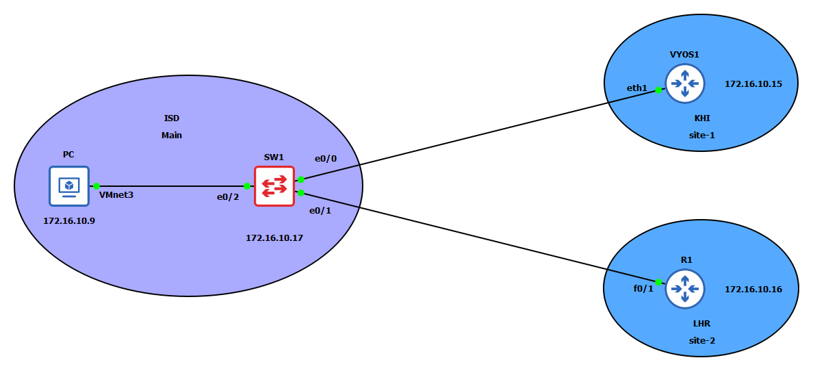

# Network Automation - Ansible and NetBox

In this blog, we'll explore how integrating Ansible with NetBox can significantly enhance network automation and management. We'll cover the basics of what NetBox is, how it complements Ansible, and provide a step-by-step guide for setting up this integration.

NetBox is an open-source IP address management (IPAM) and data center infrastructure management (DCIM) tool. It helps network engineers document and organize their network infrastructure, including devices, racks, circuits, and IP addresses. By providing a central source of truth, NetBox ensures consistency and accuracy in network documentation.

Ansible, on the other hand, is a powerful automation tool that simplifies the management of network devices, servers, and applications. Integrating Ansible with NetBox offers several benefits:

- **Centralized Inventory Management**: NetBox can act as a dynamic inventory source for Ansible, automatically pulling device information from NetBox.
- **Accurate Configuration**: By using NetBox as the source of truth, Ansible ensures configurations are consistently applied across devices.
- **Simplified Playbooks**: With NetBox providing detailed information about network devices, Ansible playbooks become simpler and more reliable.

By combining the strengths of both tools, network engineers can achieve a higher level of efficiency and reliability in managing their network infrastructure.

## Installation of NetBox

To get started with NetBox, follow the official [NetBox installation guide](https://netbox.readthedocs.io/en/stable/installation/). If you prefer to install NetBox in a Docker container, see the [Getting Started with NetBox Docker](https://github.com/netbox-community/netbox-docker/wiki/Getting-Started). I installed NetBox in a Docker container on a control node running RHEL 9.4. The lab topology is as follows:



- Two Cisco devices
- One Control node
- One VyOS router

This setup provides a practical environment for testing and experimenting with the integration of Ansible and NetBox. By using a control node, we can manage the network devices and the VyOS router efficiently, leveraging NetBox for inventory management and Ansible for automation tasks. This combination ensures a streamlined workflow for network configuration and management, making it easier to maintain consistency and accuracy across the network.

## Installation of Ansible

To install Ansible, use the following command:

```bash
pip install ansible
```

## Installation of Dependencies

Install the required dependencies for integrating Ansible with NetBox:

```bash
pip install ansible-core==2.15.0 ansible-pylibssh==1.2.0.post4 netaddr==1.3.0 pynetbox==7.3.3 pytz==2024.1
```

Next, install the Ansible Galaxy collections for NetBox and device management:

```bash
ansible-galaxy collection install netbox.netbox
ansible-galaxy collection install cisco.ios
ansible-galaxy collection install vyos.vyos
```

If you are new to Ansible, check out this [Ansible for Network Engineers](https://medium.com/@sydasif78/ansible-automation-for-network-engineers-b33238081853) guide.

These steps will set up your environment with Ansible and the necessary collections to manage your network devices through NetBox. By installing these dependencies and collections, you ensure that Ansible can seamlessly interact with NetBox and your network devices, allowing for efficient automation and management of your network infrastructure.

## Populate Network Data in NetBox

Before integrating with Ansible, ensure you have entered the following data in NetBox:

- **Site**: Navigate to the Organization section and add a site to represent the physical or logical location of your network devices.
- **Manufacturer**: Under the Devices section, add a manufacturer for your network devices (e.g., Cisco, VyOS).
- **Device Type**: Specify the type of each device in the **Device Type** section, such as different models of Cisco or VyOS devices.
- **Device Role**: Define the role of each device in the **Device Role** section, categorizing them as routers, switches, or other roles.
- **Device Platform**: Indicate the operating system or platform of each device in the **Device Platform** section, such as IOS for Cisco devices or VyOS for VyOS routers.
- **Device and IP Address**: Add a device from the Devices menu and assign an IP address to each device to ensure proper network management and automation.

Ansible requires an API token to interact with NetBox. To generate this token, navigate to the user menu and select API Tokens. For more details on using and configuring NetBox, check out this free [course](https://www.youtube.com/watch?v=IVQz2eNhzT0&list=PLGi2LPn3CWpoldqkjrydrYPbTJ_Ba3uMC&pp=iAQB) on YouTube.

By populating NetBox with accurate network data and generating an API token, you enable Ansible to effectively manage and automate your network infrastructure using the comprehensive information stored in NetBox.

## Ansible Configuration File Setup

Create or update the Ansible configuration file (`ansible.cfg`) with the following content:

```ini
[defaults]
gathering = smart
inventory = netbox_inventory.yml
host_key_checking = false
```

This configuration file sets up Ansible to use smart fact gathering, specifies the NetBox inventory file, and disables host key checking for ease of use in a lab environment.

## NetBox Inventory File Setup

Create the NetBox inventory file (`netbox_inventory.yml`) with the following content:

```yaml
---
plugin: netbox.netbox.nb_inventory
api_endpoint: http://127.0.0.1:8000
token: 4ee31d5f0910fc6122e11cbb78bf9dd049f271a4
compose:
  ansible_network_os: platform.slug

group_by: 
  - manufacturers
```

This configuration tells Ansible to use the NetBox inventory plugin, specifies the API endpoint and token, and groups the devices by their manufacturer. The `compose` section maps the device platform from NetBox to the `ansible_network_os` variable.

To verify that your devices are correctly grouped by manufacturer, use the following command:

```bash
ansible-inventory --list
```

The output should look like this:

```json
{
    "all": {
        "children": [
            "ungrouped",
            "manufacturers_cisco",
            "manufacturers_hp",
            "manufacturers_vyos"
        ]
    },
    "manufacturers_cisco": {
        "hosts": [
            "R1",
            "SW1"
        ]
    },
    "manufacturers_hp": {
        "hosts": [
            "RHEL"
        ]
    },
    "manufacturers_vyos": {
        "hosts": [
            "VYOS1"
        ]
    }
}
```

This JSON output shows the inventory groups created based on manufacturers, confirming that the devices have been correctly categorized. Each manufacturer group contains the relevant hosts, enabling Ansible to target specific devices efficiently.

By setting up Ansible with NetBox as the inventory source, you ensure that your network automation tasks are based on up-to-date and accurate network information. This integration allows for more effective and streamlined management of your network infrastructure.

### Group Variables

Define any group variables as needed for your network devices in an additional YAML file. For example, you might want to specify common configurations for devices from the same manufacturer. For example:

### `group_vars/manufacturers_cisco.yml` File

```yml
ansible_user: admin
ansible_password: cisco
ansible_connection: network_cli
```

## Example Playbook

Here is an example Ansible playbook that gathers and prints facts from various network devices:

```yaml
---
- name: "Get Facts"
  hosts: all
  gather_facts: true

  tasks:
    - name: "Display hostname"
      ansible.builtin.debug:
        msg: "{{ ansible_net_hostname }}"
      when: ansible_connection == 'network_cli'

    - name: "Display OS"
      ansible.builtin.debug:
        msg: "{{ ansible_os_family }}"
      when: ansible_connection == 'local'
```

Run the playbook using the following command:

```sh
(.venv) ➜  netbox-lab ansible-playbook access_var.yml
```

The output should look like this:

```plaintext
PLAY [Get Facts] ************************************************************************

TASK [Gathering Facts] ******************************************************************
ok: [RHEL]
ok: [SW1]
ok: [R1]
ok: [VYOS1]

TASK [Display hostname] *****************************************************************
ok: [SW1] => {
    "msg": "SW1"
}
ok: [VYOS1] => {
    "msg": "vyos"
}
ok: [R1] => {
    "msg": "R1"
}

TASK [Display OS] ***********************************************************************
ok: [RHEL] => {
    "msg": "RedHat"
}

PLAY RECAP *****************************************************************************
R1                         : ok=2    changed=0    unreachable=0    failed=0    skipped=1
RHEL                       : ok=2    changed=0    unreachable=0    failed=0    skipped=1
SW1                        : ok=2    changed=0    unreachable=0    failed=0    skipped=1
VYOS1                      : ok=2    changed=0    unreachable=0    failed=0    skipped=1
```

This playbook demonstrates how to gather facts from different types of devices and print relevant information based on the device platform.

Integrating Ansible with NetBox can streamline network management and automation, leveraging the strengths of both tools. By using NetBox as the source of truth for network data and Ansible for automation, you can achieve a more efficient and accurate network management process. This integration enables centralized inventory management, ensures consistent configuration across devices, and simplifies the creation and maintenance of automation playbooks.
